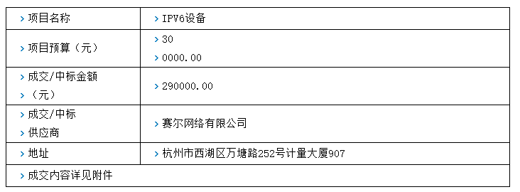
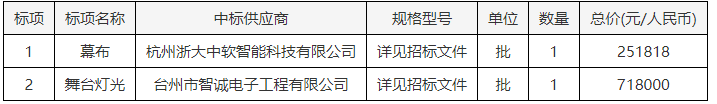

# 解析网页表格的两种方法

## 方法一：转换为字符串，正则提取

- 示例网址：

```
https://ggzy.wzzbtb.com/wzcms/zfcgzbgg/53064.htm
```

- 表格截图：



- 提取数据：

```powershell
>>> from renderer.utils import parse_form
>>> url = 'https://ggzy.wzzbtb.com/wzcms/zfcgzbgg/53064.htm'
>>> within = ('中标人', '中标单位', '中标供应商',
...           '中标公司', '中标候选人', '成交人',
...           '成交单位', '成交供应商')
>>>
>>> without = ('浏览次数', '阅读次数', '访问次数',
...            '发布时间')
>>> string = parse_form(url, within, without, to_list=False)
>>> string
'项目名称\nIPV6设备\n项目预算（元）\n300000.00\n成交/中标金额（元）\n290000.00\n成交/中标供应商\n赛尔网络有限公司\n地址\n杭州市西湖区万塘路252号计量大厦907\n成交内容详见附件\n'
```

```powershell
>>> import re
>>> re.findall(r'中标供应商\n+(.+)\n', string)
['赛尔网络有限公司']
```

## 方法二：转换为列表，循环字段

- 示例网址：

```
http://www.jj.gov.cn/art/2017/8/24/art_1326298_9970195.html
```

- 表格截图：



- 提取数据：

```powershell
>>> url = 'http://www.jj.gov.cn/art/2017/8/24/art_1326298_9970195.html'
>>> form = parse_form(url, within, without, to_list=True)
>>> form
[('标项', '标项名称', '中标供应商', '规格型号', '单位', '数量', '总价(元/人民币)'), ('1', '幕布', '杭
州浙大中软智能科技有限公司', '详见招标文件', '批', '1', '251818'), ('2', '舞台灯光', '台州市智诚电子 
工程有限公司', '详见招标文件', '批', '1', '718000')]
```

最后根据相关字段循环依次遍历即可。
